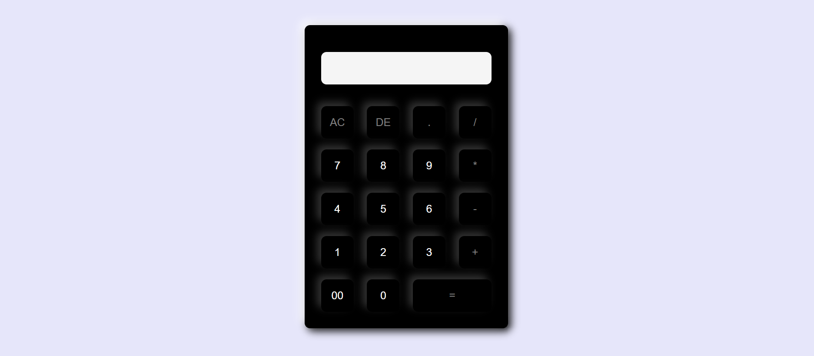

# 🧮 Basic Calculator using HTML & CSS

A simple, responsive calculator web app created using only HTML and CSS. Ideal for beginners to understand how to structure and style a basic UI layout.

---

## 🚀 Features

- Clean and minimalistic UI  
- Fully responsive layout  
- Pure HTML & CSS (no JavaScript)  
- Supports basic layout of calculator (UI only)

---

## 📸 Screenshot

 <!-- Replace with your actual image or link -->

---

## 🧰 Tech Stack

- 🟧 **HTML5** 
- 🎨 **CSS3** 

---
